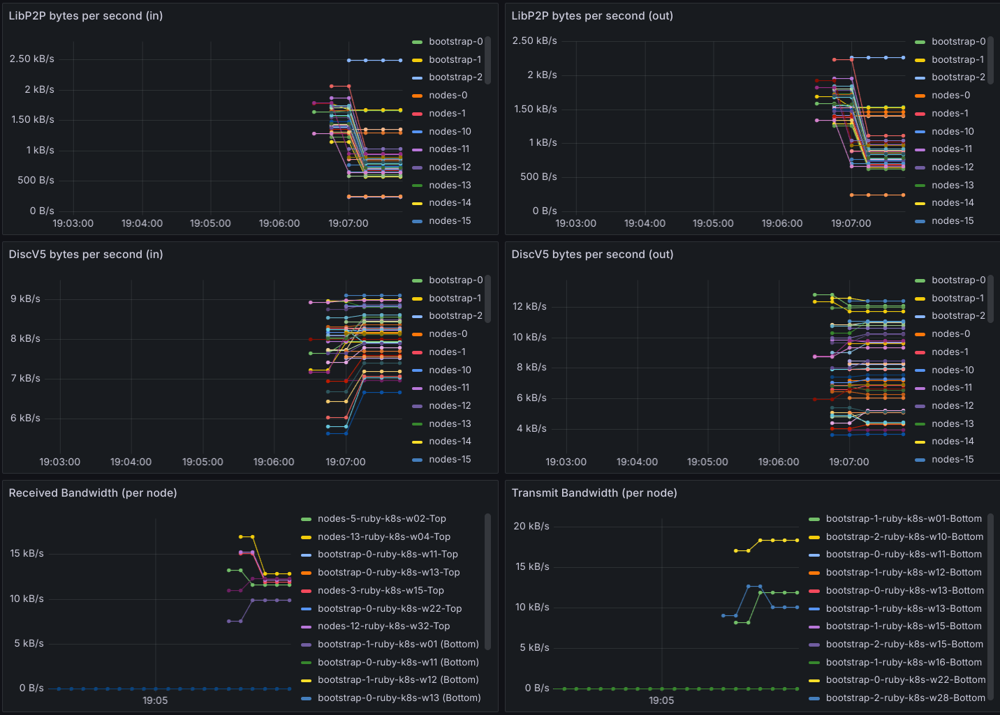

# Traffic monitor

This is a simple traffic monitor sidecar for Kubernetes pods.



It will log traffic speeds on the following ports:
- 8545: "json-rpc"
- 9000: "discv5"
- 60000: "libp2p"

Future improvements:
- Exclude overhead traffic (TCP, UDP, wire protocol, etc.)

## Usage
Build and push the image:
`bash build.sh`

Add the following stanza to your pod spec:

```
- name: traffic-monitor
    image: docker.io/zorlin/traffic-monitor
    imagePullPolicy: Always
    securityContext:
    capabilities:
        add: ["NET_RAW", "NET_ADMIN"]
    privileged: true
    runAsUser: 0
    allowPrivilegeEscalation: true
    ports:
    - containerPort: 8009
    resources:
    requests:
        memory: "64Mi"
        cpu: "50m"
    limits:
        memory: "128Mi"
        cpu: "100m"
```

It's important that the container is privileged, runs as root, and has the `NET_RAW` and `NET_ADMIN` capabilities.

## Prometheus output
The container will output metrics to Prometheus via port 8009 and a `/metrics` endpoint.

`network_bytes_in_*`
`network_bytes_out_*`

## Output
The container will also log output to stdout.

```
2025-01-29 19:05:44,641 - Started Prometheus metrics server on port 8009
2025-01-29 19:05:44,642 - Starting packet capture for ports 8545, 9000, and 60000...
2025-01-29 19:05:46,644 - json-rpc (:8545) - Total In: 0.00 B/s, Total Out: 0.00 B/s, TCP In: 0.00 B/s, TCP Out: 0.00 B/s, UDP In: 0.00 B/s, UDP Out: 0.00 B/s
2025-01-29 19:05:46,644 - discv5 (:9000) - Total In: 4963.54 B/s, Total Out: 2054.00 B/s, TCP In: 0.00 B/s, TCP Out: 0.00 B/s, UDP In: 4963.54 B/s, UDP Out: 2054.00 B/s
2025-01-29 19:05:46,644 - libp2p (:60000) - Total In: 0.00 B/s, Total Out: 0.00 B/s, TCP In: 0.00 B/s, TCP Out: 0.00 B/s, UDP In: 0.00 B/s, UDP Out: 0.00 B/s
2025-01-29 19:05:48,646 - json-rpc (:8545) - Total In: 0.00 B/s, Total Out: 0.00 B/s, TCP In: 0.00 B/s, TCP Out: 0.00 B/s, UDP In: 0.00 B/s, UDP Out: 0.00 B/s
2025-01-29 19:05:48,647 - discv5 (:9000) - Total In: 503.35 B/s, Total Out: 4935.65 B/s, TCP In: 0.00 B/s, TCP Out: 0.00 B/s, UDP In: 503.35 B/s, UDP Out: 4935.65 B/s
2025-01-29 19:05:48,647 - libp2p (:60000) - Total In: 0.00 B/s, Total Out: 0.00 B/s, TCP In: 0.00 B/s, TCP Out: 0.00 B/s, UDP In: 0.00 B/s, UDP Out: 0.00 B/s
2025-01-29 19:05:50,649 - json-rpc (:8545) - Total In: 0.00 B/s, Total Out: 0.00 B/s, TCP In: 0.00 B/s, TCP Out: 0.00 B/s, UDP In: 0.00 B/s, UDP Out: 0.00 B/s
2025-01-29 19:05:50,649 - discv5 (:9000) - Total In: 6003.41 B/s, Total Out: 2956.02 B/s, TCP In: 0.00 B/s, TCP Out: 0.00 B/s, UDP In: 6003.41 B/s, UDP Out: 2956.02 B/s
2025-01-29 19:05:50,649 - libp2p (:60000) - Total In: 0.00 B/s, Total Out: 0.00 B/s, TCP In: 0.00 B/s, TCP Out: 0.00 B/s, UDP In: 0.00 B/s, UDP Out: 0.00 B/s
2025-01-29 19:05:52,650 - json-rpc (:8545) - Total In: 0.00 B/s, Total Out: 0.00 B/s, TCP In: 0.00 B/s, TCP Out: 0.00 B/s, UDP In: 0.00 B/s, UDP Out: 0.00 B/s
2025-01-29 19:05:52,650 - discv5 (:9000) - Total In: 1544.92 B/s, Total Out: 27287.84 B/s, TCP In: 0.00 B/s, TCP Out: 0.00 B/s, UDP In: 1544.92 B/s, UDP Out: 27287.84 B/s
2025-01-29 19:05:52,650 - libp2p (:60000) - Total In: 0.00 B/s, Total Out: 0.00 B/s, TCP In: 0.00 B/s, TCP Out: 0.00 B/s, UDP In: 0.00 B/s, UDP Out: 0.00 B/s
2025-01-29 19:05:54,652 - json-rpc (:8545) - Total In: 0.00 B/s, Total Out: 0.00 B/s, TCP In: 0.00 B/s, TCP Out: 0.00 B/s, UDP In: 0.00 B/s, UDP Out: 0.00 B/s
2025-01-29 19:05:54,653 - discv5 (:9000) - Total In: 1621.98 B/s, Total Out: 29529.18 B/s, TCP In: 0.00 B/s, TCP Out: 0.00 B/s, UDP In: 1621.98 B/s, UDP Out: 29529.18 B/s
2025-01-29 19:05:54,653 - libp2p (:60000) - Total In: 0.00 B/s, Total Out: 0.00 B/s, TCP In: 0.00 B/s, TCP Out: 0.00 B/s, UDP In: 0.00 B/s, UDP Out: 0.00 B/s
2025-01-29 19:05:56,655 - json-rpc (:8545) - Total In: 0.00 B/s, Total Out: 0.00 B/s, TCP In: 0.00 B/s, TCP Out: 0.00 B/s, UDP In: 0.00 B/s, UDP Out: 0.00 B/s
2025-01-29 19:05:56,655 - discv5 (:9000) - Total In: 17788.31 B/s, Total Out: 4185.69 B/s, TCP In: 0.00 B/s, TCP Out: 0.00 B/s, UDP In: 17788.31 B/s, UDP Out: 4185.69 B/s
```
