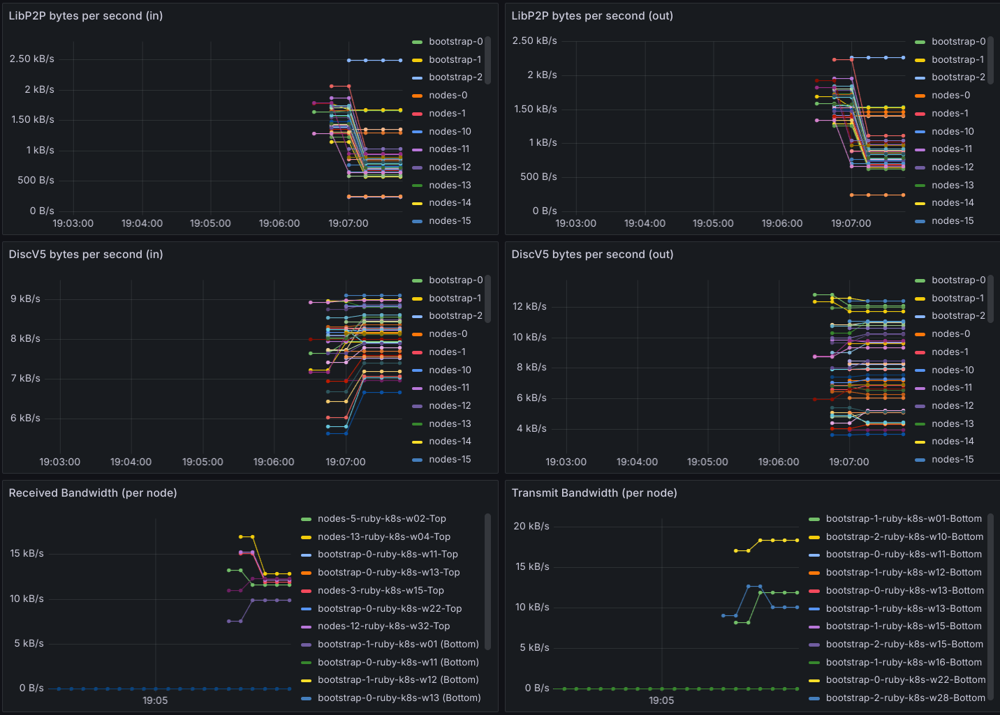

# Traffic monitor

This is a simple traffic monitor sidecar for Kubernetes pods.



It will log traffic speeds on the following ports by default:
- 8545: "json-rpc"
- 9000: "discv5"
- 60000: "libp2p"

If it is given custom ports via the --ports flag, it will log the traffic speeds for those ports.

## Usage
Build and push the image:
`bash build.sh`

Add the following stanza to your pod spec:

```
  - name: traffic-monitor
    image: docker.io/zorlin/traffic-monitor:v0.1.0
    imagePullPolicy: IfNotPresent
    command: ["python", "traffic_monitor.py", "--ports", "8545", "9000", "60000"]
    securityContext:
    capabilities:
        add: ["NET_RAW", "NET_ADMIN"]
    privileged: true
    runAsUser: 0
    allowPrivilegeEscalation: true
    ports:
    - containerPort: 8009
    resources:
    requests:
        memory: "64Mi"
        cpu: "50m"
    limits:
        memory: "128Mi"
        cpu: "100m"
```

It's important that the container is privileged, runs as root, and has the `NET_RAW` and `NET_ADMIN` capabilities.

## Grafana dashboard
* Import the Nwaku dashboard from "nWaku Raw bandwidth"
* Spawn simulations listening on port http://localhost:8009/metrics and update your Prometheus or VictoriaMetrics config to scrape these.
* Simulations will appear in the dashboard.

## Prometheus output
The container will output metrics to Prometheus via port 8009 and a `/metrics` endpoint.

`network_bytes_in_*`
`network_bytes_out_*`

## Output
The container will also log output to stdout.

```
2025-02-16 23:16:37,721 - Detected pod IP: 10.7.1.101
2025-02-16 23:16:37,726 - Started Prometheus metrics server on port 8009
2025-02-16 23:16:37,726 - Starting packet capture for ports: 8545, 9000, 60000...
2025-02-16 23:16:42,731 - Overall Total In: 0.00 B/s, Overall Total Out: 0.00 B/s
2025-02-16 23:16:42,731 - Port 8545 - Total In: 0.00 B/s, Total Out: 0.00 B/s, TCP In: 0.00 B/s, TCP Out: 0.00 B/s, UDP In: 0.00 B/s, UDP Out: 0.00 B/s
2025-02-16 23:16:42,731 - Port 9000 - Total In: 0.00 B/s, Total Out: 0.00 B/s, TCP In: 0.00 B/s, TCP Out: 0.00 B/s, UDP In: 0.00 B/s, UDP Out: 0.00 B/s
2025-02-16 23:16:42,732 - Port 60000 - Total In: 0.00 B/s, Total Out: 0.00 B/s, TCP In: 0.00 B/s, TCP Out: 0.00 B/s, UDP In: 0.00 B/s, UDP Out: 0.00 B/s
```
